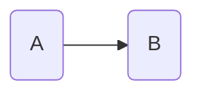

[[toc]]


# Definitions

FITT is the best descriptor of progress.
A goal is a past-tense description of a future event.
That event is the FITT principle.
"I want to have done this." or "I want for this to have occurred."



## Example

Goal is to improve cardio health.


```python
# i have 60 minutes for each 'type'
# divide it evenly
total time = 60

types = [cardio, HIIT, boxing]

# but take boxing:
# is it bag work, shadow boxing?
# 9 minutes of bag work, pad work, shadow boxing
# versus one hour of pad work, or one hour of shadow boxing
# depends on the goal
# does this FITT applied to this type take me to my goal

for type in types:

```

"I want to have done 5 sessions of 60% heart-rate for week." 

It is past tense.

The 

## FITT

| header    | metric   | x:T         |
| ------    | ---      | ---         |
| Frequency | periodic | $\lambda/t$ |
| Intensity | scalar   | $$          |
| Time      | scalar   | $$          |
| Type      | kind     | $$          |

## Goals

# Place to store business ideas and concepts

# Books recommended by Andy

- []()

