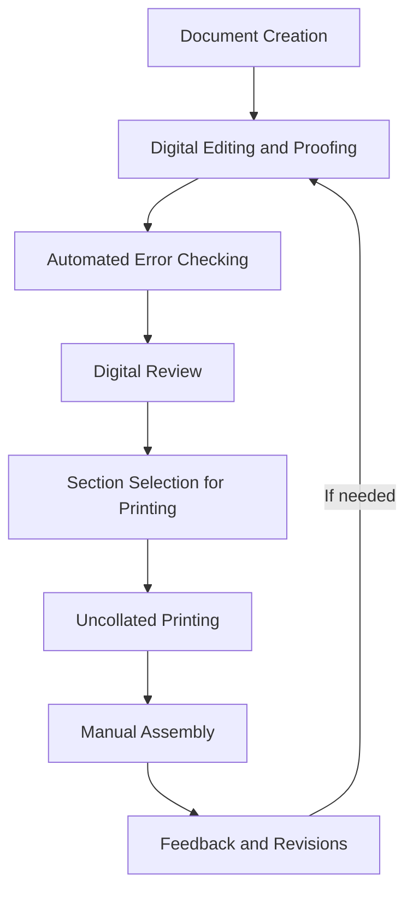

[[toc]]

# Options to use with `-o [option]`

## collate

Run this to print 7 copies of a document (with pages collated).

```bash
N_COPIES=-#7

lpr $FILE $N_COPIES -o collate=true
```

I hate when my documents not collated; can't think of a use for it.

Turned to ChatGPT for help; turns out it's retarded:


## page-ranges
Other common `lpr` options are `page-ranges`, which implies you can use a comma like `1-3,7-10`. 
I always mistakenly type this as `page-range`.
